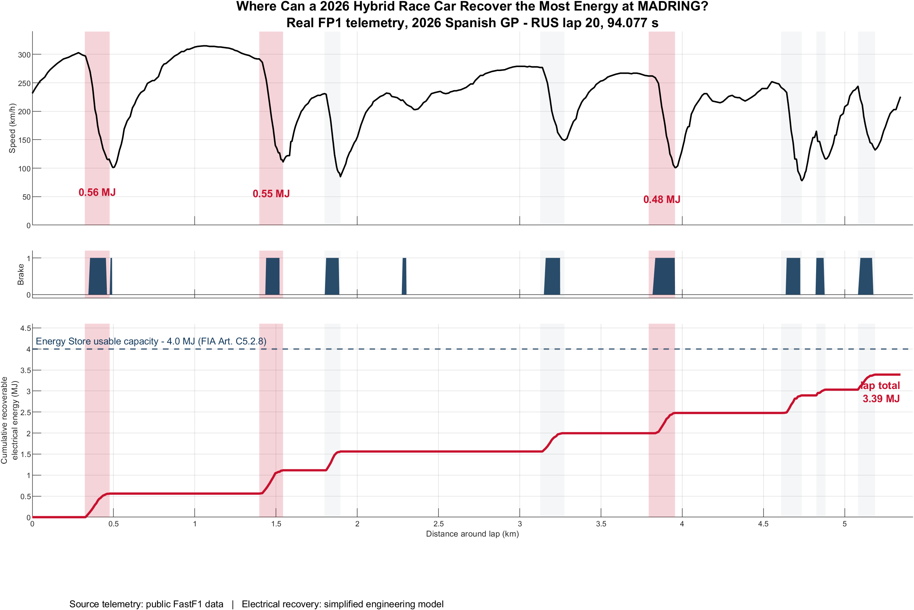
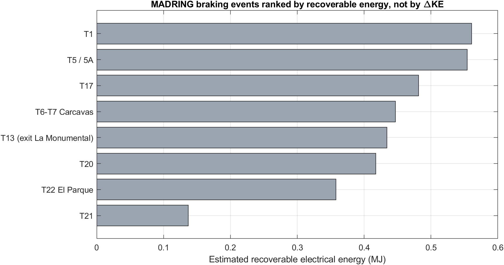

# Madring

## Regenerative Braking Analysis from MADRING FP1 Telemetry

**Question:** How does braking-zone severity affect modeled MGU-K energy recovery?

This project uses public FastF1 telemetry from a single FP1 lap at MADRING and a deliberately simplified MATLAB/Simulink recovery model. The goal is not to reproduce a Formula 1 team's ERS strategy. It is to test a narrower engineering question: **does the largest braking event necessarily provide the largest recoverable-energy opportunity?**



## Scope

The current case study analyzes **RUS lap 20 from FP1 (1:34.077)**. The telemetry pipeline selected the fastest available timed FP1 lap when the dataset was pulled.

This is a **single-lap analysis**, so the results should not be read as a full-field or circuit-wide conclusion. A natural next step is to repeat the same pipeline across drivers, laps and sessions.

## Result

The analysis detected **8 significant braking events**. Under the baseline model assumptions, the lap produced approximately **3.39 MJ of modeled recoverable electrical energy**.

The three highest modeled recovery opportunities were:

| Braking zone | Modeled recovery |
|---|---:|
| T1 | 0.56 MJ |
| T5 | 0.55 MJ |
| T17 | 0.48 MJ |



The main observation is that **braking severity alone does not determine the recovery ranking**. Kinetic-energy reduction is only the starting point; the simplified model then applies resistive losses, rear-axle availability, conversion efficiency and an electrical power ceiling before estimating recoverable energy.

A nine-case sensitivity sweep changes the absolute recovery estimate, but is used to check whether the ranking is robust to the development assumptions rather than relying on one parameter set.

## What is measured, derived and modeled?

| Category | Quantities |
|---|---|
| Public telemetry | Speed, throttle, brake, RPM, gear, DRS, position, time |
| Derived | Braking-event boundaries, duration, speed reduction, kinetic-energy reduction, event ranking |
| Modeled | Rear-axle recovery potential, MGU-K electrical power, recoverable electrical energy, Energy Store behavior |

FastF1 does **not** expose actual battery SOC, actual MGU-K power, actual recovered energy, brake torque or a team's proprietary ERS strategy.

## Method

The analysis pipeline is intentionally small and auditable:

```text
FastF1 FP1 telemetry
        |
        v
braking-event detection
        |
        v
kinetic-energy reduction
        |
        v
modeled resistive losses
        |
        v
rear-axle availability + conversion efficiency
        |
        v
350 kW electrical ceiling
        |
        v
estimated recoverable electrical energy
```

`detectBrakingEvents.m` finds braking events from the measured brake signal and speed trace. `buildPowerSignals.m` converts the telemetry-derived deceleration into the simplified electrical-recovery estimate. `sweepAssumptions.m` reruns the calculation under nine parameter cases. `buildRegenSimulink.m` creates a minimal Simulink implementation so the integration can be checked independently from the MATLAB calculation.

## Model assumptions

The model uses development assumptions for quantities that are not available in public telemetry, including effective vehicle mass, aerodynamic loss, rolling resistance, rear-axle recovery fraction and aggregate conversion efficiency. They are kept in `madringParams.m` rather than hidden inside the analysis functions.

The project uses a **350 kW electrical ceiling** and **4 MJ Energy Store operating window** as 2026 regulatory constraints for the study. Anyone extending the work should verify the values against the current FIA 2026 Technical Regulations before reuse.

## MATLAB and Simulink

The MATLAB implementation performs the event-level analysis and sensitivity sweep. The Simulink model independently integrates the same telemetry-derived recovery-power signal after the electrical ceiling.

Agreement between the two implementations is an **internal consistency check**, not validation against measured Formula 1 MGU-K or Energy Store data.

## Repository

```text
Madring/
├── fetch_madring_session.py   # FastF1 telemetry retrieval/export
├── loadMadringTelemetry.m     # MATLAB telemetry loader
├── madringParams.m            # constraints and development assumptions
├── detectBrakingEvents.m      # telemetry-based event detection
├── buildPowerSignals.m        # simplified recovery calculation
├── sweepAssumptions.m         # nine-case sensitivity sweep
├── buildRegenSimulink.m       # generates the Simulink model
├── runSimulinkRegen.m         # MATLAB/Simulink consistency check
├── runMadringStudy.m          # end-to-end study
├── makeMainFigure.m           # main technical figure
├── MADRING_regen_main.png
├── MADRING_ranked_bar.png
├── HOWTO.md
└── requirements.txt
```

Generated telemetry CSVs, FastF1 caches and generated `.slx` files are intentionally excluded from version control.

## Reproduce

```bash
git clone https://github.com/ProjectsofSadia/Madring.git
cd Madring
pip install -r requirements.txt
python fetch_madring_session.py
```

Then run in MATLAB:

```matlab
runMadringStudy
```

See `HOWTO.md` for details.

## Limitations

This is a simplified public-data study, not a validated Formula 1 power-unit model. The current analysis uses one FP1 lap and a binary public brake channel. Public telemetry does not provide brake torque, brake bias, MGU-K torque/power, Energy Store SOC, electrical losses, control logic or team calibration. Aerodynamic, rolling, rear-axle and efficiency terms are therefore development assumptions and are tested through sensitivity analysis.

The telemetry distance is FastF1's integrated lap distance rather than a surveyed circuit centerline, so it should not be treated as an official circuit-length measurement.

## Next step

Run the same pipeline across multiple drivers and sessions and test whether **T1, T5 and T17** remain the highest modeled recovery opportunities or whether the ranking changes with driving profile and session conditions.

---

Independent, unofficial engineering analysis using public data. No proprietary team telemetry or confidential Formula 1 data is used.
